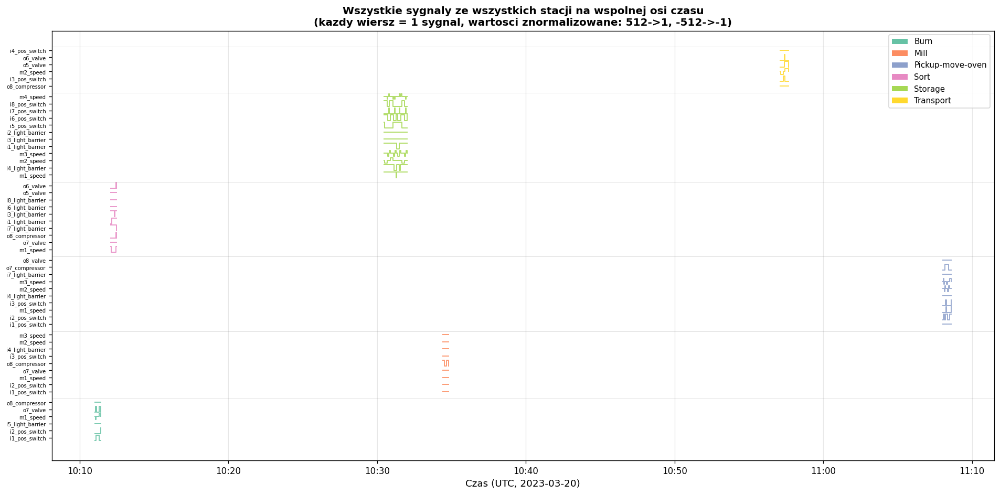
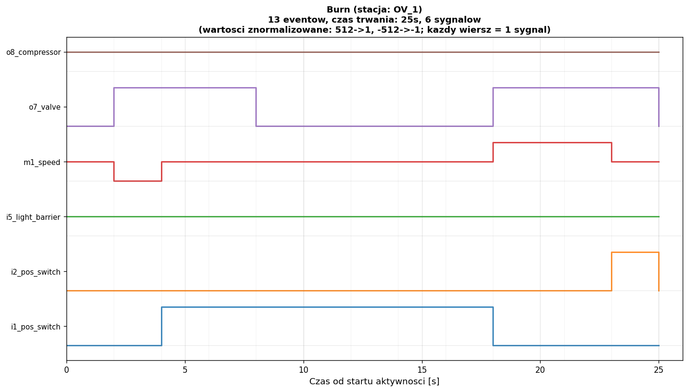
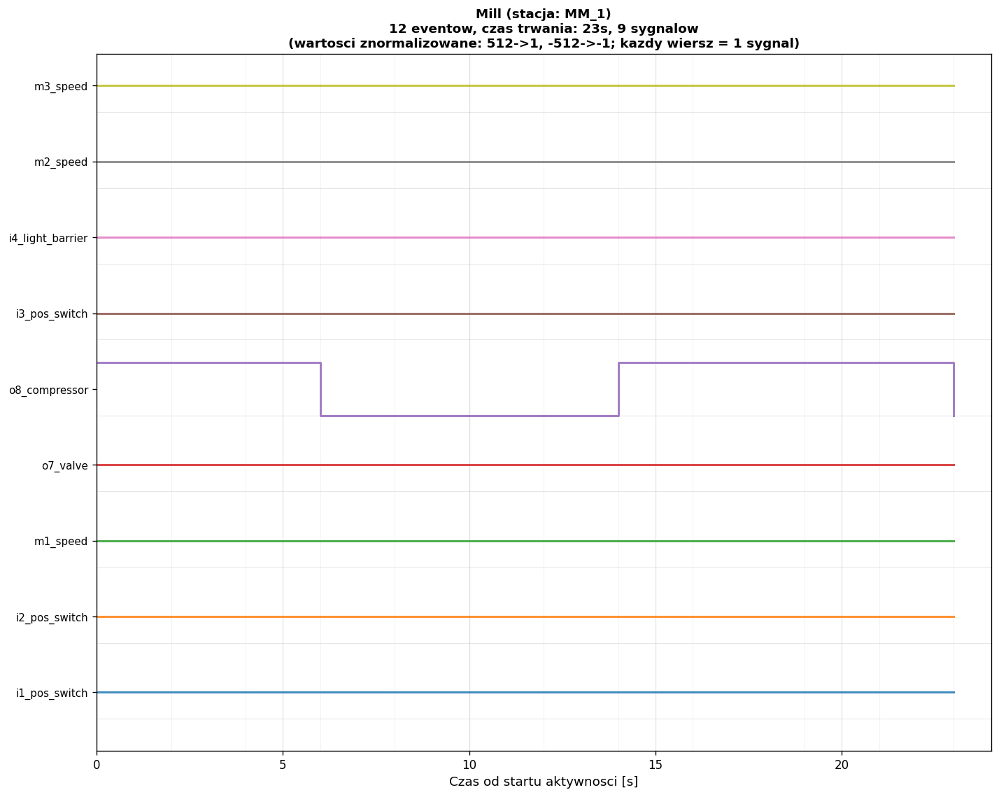
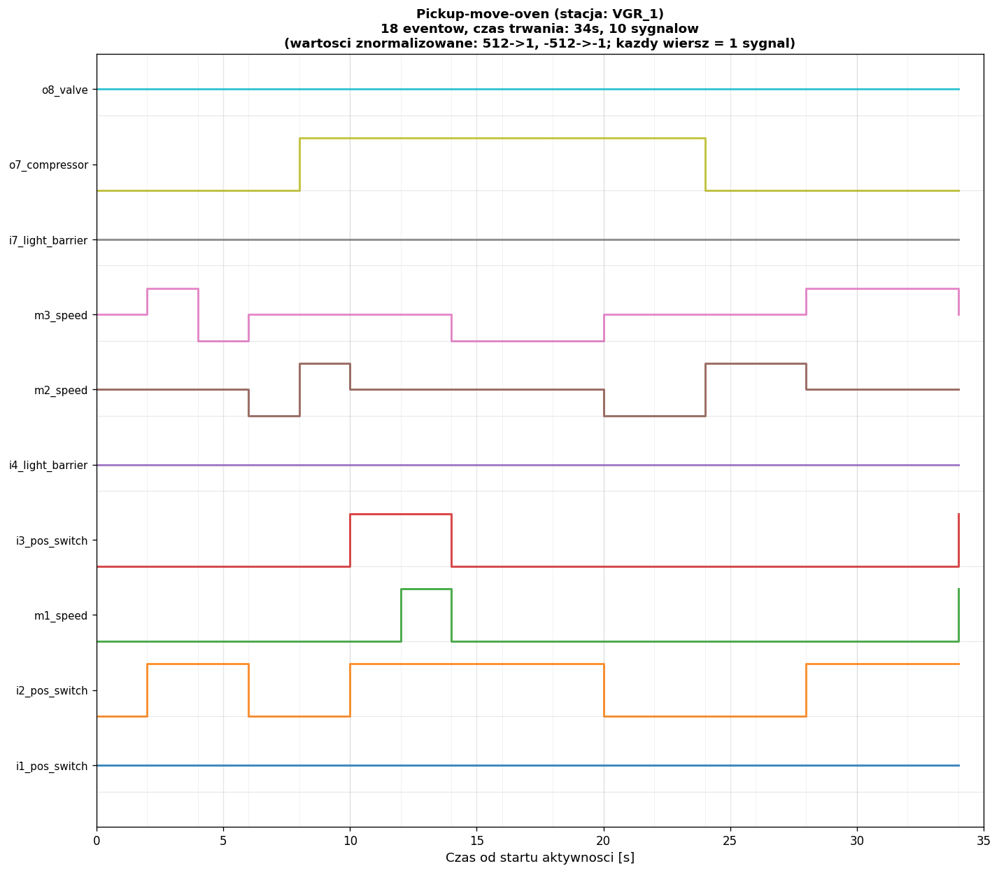
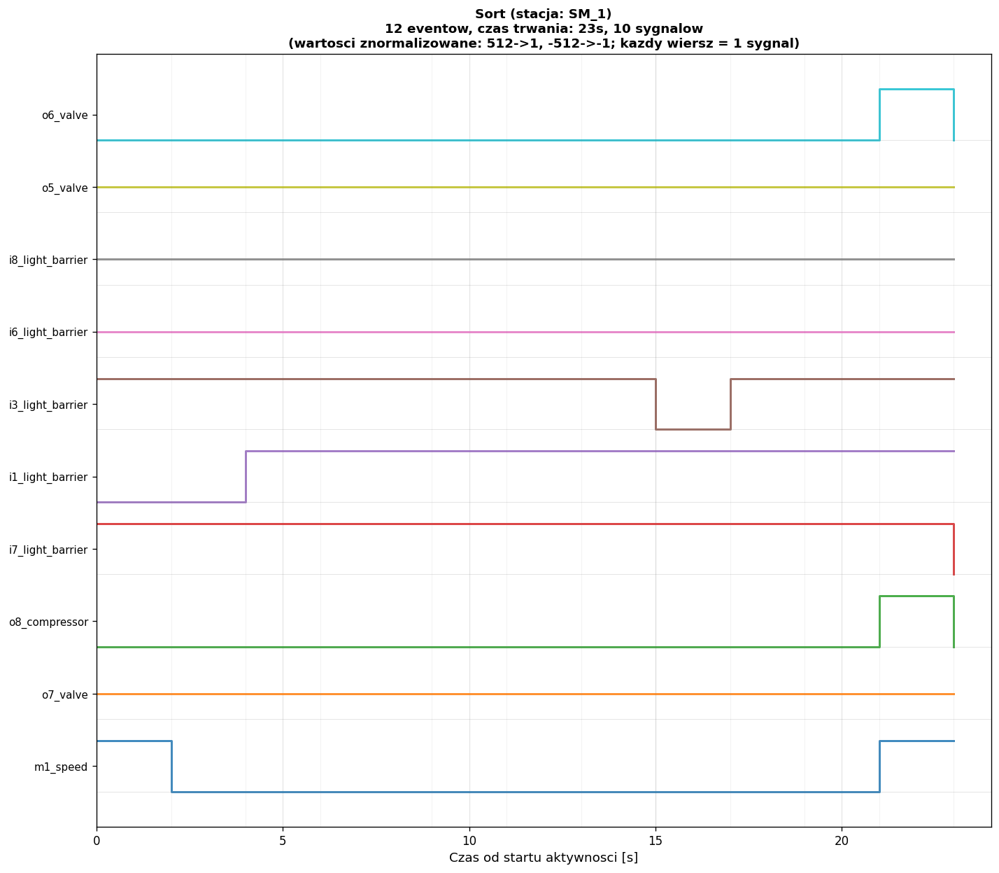
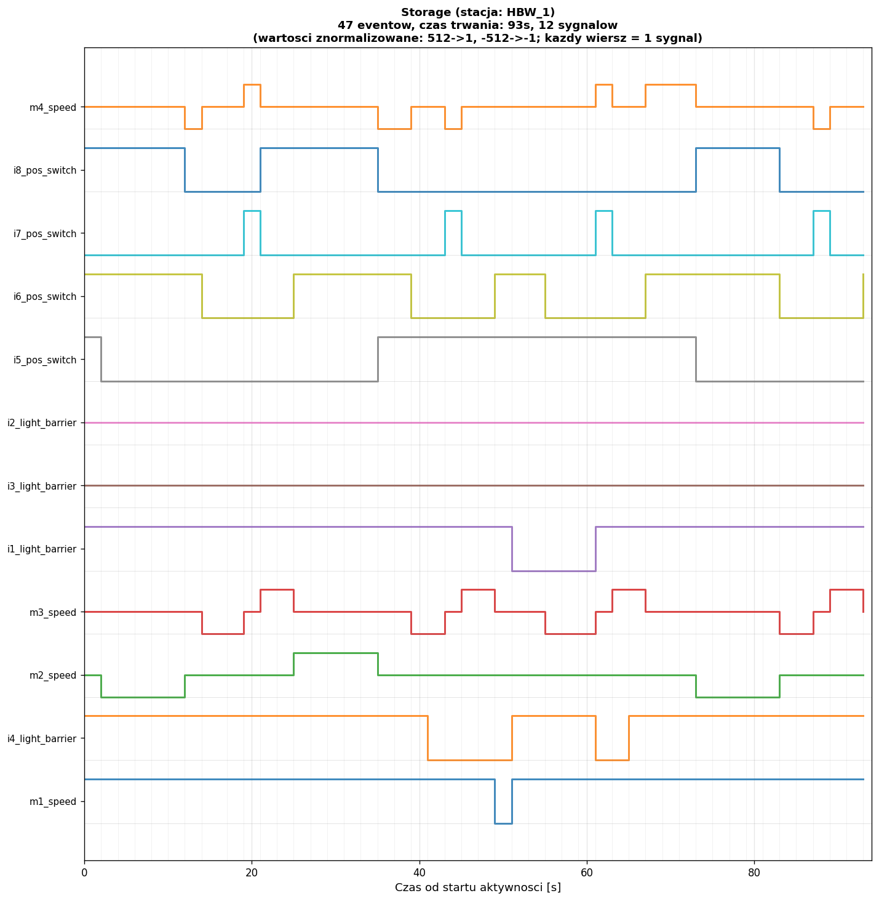
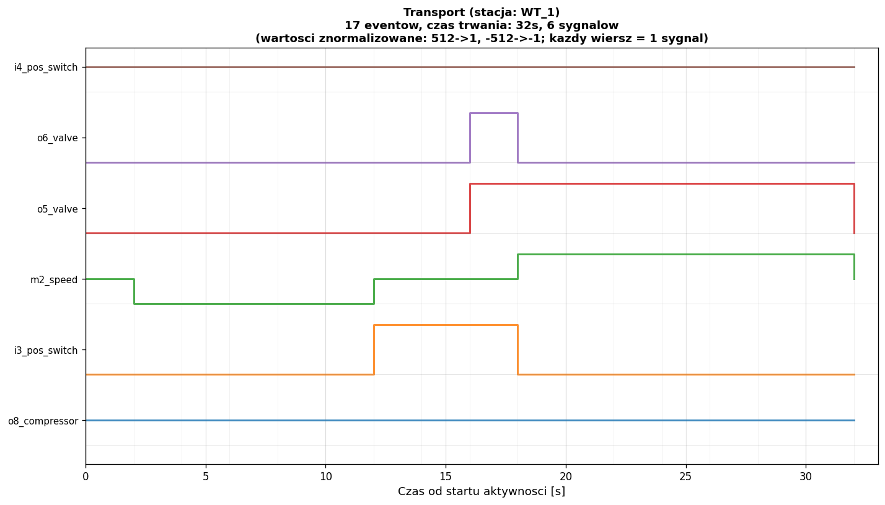

# Milestone 1 - Zrozumienie zbioru danych

## 1. Kontekst i opis zbioru danych

### Środowisko produkcyjne

Analizowany zbiór pochodzi z laboratoryjnego środowiska produkcyjnego **Fischertechnik** (model fabryki modułowej), opisanego w publikacji na platformie Zenodo (https://zenodo.org/records/8087219). Jest to cyber-fizyczny system produkcyjny złożony z kilku stacji roboczych połączonych transporterem. Każda stacja realizuje określoną operację technologiczną na detalu (workpiece).

Stacje produkcyjne w zbiorze:
- **OV_1** – piec (oven) – realizuje aktywność **Burn** (wypalanie/podgrzewanie detalu)
- **MM_1** – frezarka (milling machine) – realizuje aktywność **Mill** (frezowanie)
- **SM_1** – sortownica (sorting machine) – realizuje aktywność **Sort** (sortowanie)
- **VGR_1** – robot chwytakowy (vacuum gripper robot) – realizuje aktywność **Pickup-move-oven** (pobranie i przeniesienie do pieca)
- **HBW_1** – magazyn wysokiego składowania (high-bay warehouse) – realizuje aktywność **Storage** (składowanie)
- **WT_1** – wózek transportowy (workpiece transport) – realizuje aktywność **Transport** (transport)

### Rodzaje czujników i aktuatorów

Każde zdarzenie zawiera wektor sygnałów ze stacji. Sygnały dzielą się na:

- **Czujniki pozycji (i*_pos_switch)** – przełączniki krańcowe, wartości binarne: `0` (nie wyzwolony) lub `1` (wyzwolony)
- **Bariery świetlne (i*_light_barrier)** – czujniki obecności detalu, wartości binarne: `0` (brak detalu) lub `1` (detal wykryty)
- **Silniki (m*_speed)** – prędkość silnika, wartości: `0` (stop), `512` (obrót w przód), `-512` (obrót wstecz)
- **Zawory (o*_valve)** – sterowanie pneumatyczne, wartości: `0` (zamknięty) lub `512` (otwarty)
- **Sprężarki/kompresory (o*_compressor)** – wartości: `0` (wyłączona) lub `512` (włączona)

Wartości `512` i `-512` (zamiast `1` i `-1`) wynikają z reprezentacji sygnałów PLC w skali 10-bitowej.

### Struktura pojedynczego rekordu

Każdy rekord JSON w pliku `Signature_*.txt` ma postać:
```json
{"station": "OV_1", "timestamp": "2023-03-20T10:11:01Z", "events": {"i1_pos_switch": 0, "i2_pos_switch": 0, ...}}
```

Pola:
- `station` – identyfikator stacji (zasób techniczny)
- `timestamp` – znacznik czasu ISO 8601 (UTC), próbkowanie co ~2 sekundy
- `events` – słownik sygnałów aktywnych w danej stacji

---

## 2. Kluczowe atrybuty logu zdarzeń

| Atrybut | Dostępny | Źródło | Uwagi |
|---------|----------|--------|-------|
| `case_id` | Tak (odtworzony) | Nazwa pliku `Signature_*` | Brak jawnego `case_id` w rekordzie JSON |
| `activity` | Tak (odtworzona) | Nazwa pliku `Signature_*` | Brak jawnego pola `activity` w rekordzie |
| `timestamp` | Tak | Pole `timestamp` | Format ISO 8601, UTC, próbkowanie ~2s |
| `resource` | Tak (proxy) | Pole `station` | Brak zasobu ludzkiego; dostępna stacja/maszyna |

**Ograniczenia:** Każdy plik sygnatury reprezentuje **jeden przypadek (case)** jednej aktywności. W rzeczywistym procesie produkcyjnym detal przechodzi przez wiele stacji – pełny log procesu wymagałby połączenia sygnatur z wielu stacji w jeden ślad przypadku.

---

## 3. Podstawowe statystyki zbioru

### Statystyki globalne

| Metryka | Wartość |
|---------|---------|
| Łączna liczba eventów | **119** |
| Liczba przypadków (cases) | **6** |
| Liczba aktywności | **6** |
| Liczba stacji | **6** |
| Łączna liczba kolumn sygnałów | **26** |
| Zakres czasowy | 2023-03-20, 10:11 – 11:08 UTC |

### Liczba eventów i czas trwania per aktywność

| Aktywność | Stacja | Liczba eventów | Czas trwania | Liczba sygnałów |
|-----------|--------|---------------|--------------|-----------------|
| Burn | OV_1 | **13** | ~25 s (10:11:01–10:11:26) | 6 |
| Mill | MM_1 | **12** | ~23 s (10:34:25–10:34:48) | 8 |
| Sort | SM_1 | **12** | ~23 s (10:12:06–10:12:29) | 10 |
| Pickup-move-oven | VGR_1 | **18** | ~34 s (11:08:02–11:08:36) | 10 |
| Storage | HBW_1 | **47** | ~93 s (10:30:28–10:32:01) | 12 |
| Transport | WT_1 | **17** | ~32 s (10:57:07–10:57:39) | 6 |
| **SUMA** | | **119** | | |

**Obserwacje:**
- Aktywność **Storage** dominuje liczbą eventów (47 z 119, tj. **39,5%** wszystkich zdarzeń) i czasem trwania (93 s). Wynika to ze złożoności operacji magazynowania – robot HBW_1 wykonuje wiele ruchów w trzech osiach (m1, m2, m3, m4_speed).
- Aktywności **Burn**, **Mill** i **Sort** mają zbliżoną liczbę eventów (12–13) i czas trwania (~23–25 s).
- **Pickup-move-oven** i **Transport** są pośrednie (17–18 eventów, ~32–34 s).
- Próbkowanie jest regularne – co ~2 sekundy, z nielicznymi wyjątkami (np. Burn: event 10–11 co 3 s).

### Kolejność aktywności w czasie (timeline)

Wszystkie aktywności zarejestrowano tego samego dnia (2023-03-20). Kolejność chronologiczna:

```
10:11  Burn          (OV_1)
10:12  Sort          (SM_1)
10:30  Storage       (HBW_1)
10:34  Mill          (MM_1)
10:57  Transport     (WT_1)
11:08  Pickup-move-oven (VGR_1)
```

Aktywności **nie nakładają się** w czasie – każda sygnatura reprezentuje odrębny, sekwencyjny przypadek.

---

## 4. Analiza jakości danych

### Wyniki kontroli jakości

| Sprawdzenie | Wynik | Interpretacja |
|-------------|-------|---------------|
| Duplikaty wierszy | **0** | Brak zduplikowanych rekordów |
| Duplikaty (case_id, timestamp, station) | **0** | Brak zduplikowanych zdarzeń |
| Błędy parsowania timestamp | **0** | Wszystkie 119 timestampów poprawnie sparsowane |
| Niemonotoniczność timestampów | **0** przypadków | Czasy rosną monotonicznie w każdym case |
| Błędy typów sygnałów | **0** | Wszystkie wartości sygnałów są liczbowe |
| Kolumny z brakującymi wartościami | **26 z 32** | Patrz wyjaśnienie poniżej |

### Brakujące wartości – wyjaśnienie

W połączonej tabeli `df_full` (119 wierszy × 32 kolumny) większość kolumn sygnałów zawiera wartości `NaN`. Jest to **zachowanie oczekiwane i poprawne**, nie błąd danych.

Przyczyna: każda stacja używa tylko swoich czujników i aktuatorów. Np.:
- Stacja **OV_1** (Burn) raportuje tylko: `i1_pos_switch`, `i2_pos_switch`, `i5_light_barrier`, `m1_speed`, `o7_valve`, `o8_compressor` – pozostałe 20 kolumn to `NaN`
- Stacja **HBW_1** (Storage) raportuje: `i1–i4_light_barrier`, `i5–i8_pos_switch`, `m1–m4_speed` – 12 sygnałów

Tabela pokrycia sygnałów per aktywność:

| Aktywność | Sygnały aktywne | Sygnały nieaktywne (NaN) |
|-----------|----------------|--------------------------|
| Burn | 6 | 20 |
| Mill | 8 | 18 |
| Sort | 10 | 16 |
| Pickup-move-oven | 10 | 16 |
| Storage | 12 | 14 |
| Transport | 6 | 20 |

**Wniosek:** Brakujące wartości wynikają z architektury systemu (każda stacja ma własny zestaw czujników), a nie z błędów pomiarowych. Dane są kompletne w zakresie sygnałów właściwych dla każdej stacji.

### Pełna analiza wartości sygnałów – wszystkie aktywności / stacje

Sygnały przyjmują wyłącznie wartości ze zbioru `{-512, 0, 1, 512}`. Brak wartości odstających ani anomalii numerycznych. Poniżej pełna analiza każdego sygnału dla każdej aktywności.

#### Burn (OV_1) – 13 eventów, 6 sygnałów

| Sygnał | Typ | Wartości w danych | Rozkład (ile eventów) | Interpretacja |
|--------|-----|-------------------|----------------------|---------------|
| `i1_pos_switch` | czujnik pozycji | 0, 1 | 0: 5 eventów, 1: 8 eventów | Przełącznik krańcowy pozycji 1 (drzwi pieca zamknięte) |
| `i2_pos_switch` | czujnik pozycji | 0, 1 | 0: 12 eventów, 1: 1 event | Przełącznik krańcowy pozycji 2 (drzwi pieca otwarte) |
| `i5_light_barrier` | bariera świetlna | 1 | 1: 13 eventów (stała) | Detal obecny w piecu przez cały cykl |
| `m1_speed` | silnik | -512, 0, 512 | -512: 2 ev., 0: 9 ev., 512: 2 ev. | Silnik napędu drzwi: -512=otwieranie, 0=stop, 512=zamykanie |
| `o7_valve` | zawór | 0, 512 | 0: 7 eventów, 512: 6 eventów | Zawór pneumatyczny podtrzymujący pozycję |
| `o8_compressor` | sprężarka | 0 | 0: 13 eventów (stała) | Sprężarka nieaktywna w tym cyklu |

#### Mill (MM_1) – 12 eventów, 9 sygnałów

| Sygnał | Typ | Wartości w danych | Rozkład (ile eventów) | Interpretacja |
|--------|-----|-------------------|----------------------|---------------|
| `i1_pos_switch` | czujnik pozycji | 1 | 1: 12 eventów (stała) | Detal zamocowany przez cały cykl |
| `i2_pos_switch` | czujnik pozycji | 0 | 0: 12 eventów (stała) | Pozycja 2 niewyzwolona |
| `i3_pos_switch` | czujnik pozycji | 0 | 0: 12 eventów (stała) | Pozycja 3 niewyzwolona |
| `i4_light_barrier` | bariera świetlna | 1 | 1: 12 eventów (stała) | Detal obecny przez cały cykl |
| `m1_speed` | silnik | 0 | 0: 12 eventów (stała) | Silnik osi X nieaktywny |
| `m2_speed` | silnik | 0 | 0: 12 eventów (stała) | Silnik osi Y nieaktywny |
| `m3_speed` | silnik | 0 | 0: 12 eventów (stała) | Silnik osi Z nieaktywny |
| `o7_valve` | zawór | 0 | 0: 12 eventów (stała) | Zawór nieaktywny |
| `o8_compressor` | sprężarka | 0, 512 | 0: 6 eventów, 512: 6 eventów | Sprężarka: cyklicznie włączana/wyłączana (mocowanie detalu) |

**Uwaga:** W Mill jedynym sygnałem zmieniającym wartość jest `o8_compressor` — cykl frezowania polega na włączeniu/wyłączeniu sprężarki (mocowanie pneumatyczne). Silniki i czujniki pozostają stałe.

#### Sort (SM_1) – 12 eventów, 10 sygnałów

| Sygnał | Typ | Wartości w danych | Rozkład (ile eventów) | Interpretacja |
|--------|-----|-------------------|----------------------|---------------|
| `i1_light_barrier` | bariera świetlna | 0, 1 | 0: 2 ev., 1: 10 ev. | Detal na wejściu taśmy (pojawia się w event 3) |
| `i3_light_barrier` | bariera świetlna | 0, 1 | 0: 1 ev., 1: 11 ev. | Bariera środkowa (krótkie przerwanie w event 8) |
| `i6_light_barrier` | bariera świetlna | 1 | 1: 12 eventów (stała) | Bariera pozycji 6 – stale aktywna |
| `i7_light_barrier` | bariera świetlna | 0, 1 | 0: 1 ev., 1: 11 ev. | Bariera wyjścia (detal opuszcza w event 12) |
| `i8_light_barrier` | bariera świetlna | 1 | 1: 12 eventów (stała) | Bariera pozycji 8 – stale aktywna |
| `m1_speed` | silnik | -512, 0 | -512: 10 ev., 0: 2 ev. | Taśmociąg: -512=jazda (większość cyklu), 0=stop |
| `o5_valve` | zawór | 0 | 0: 12 eventów (stała) | Zawór 5 nieaktywny |
| `o6_valve` | zawór | 0, 512 | 0: 11 ev., 512: 1 ev. | Zawór kierujący detal (aktywny w event 11) |
| `o7_valve` | zawór | 0 | 0: 12 eventów (stała) | Zawór 7 nieaktywny |
| `o8_compressor` | sprężarka | 0, 512 | 0: 11 ev., 512: 1 ev. | Sprężarka (aktywna razem z o6_valve w event 11) |

#### Pickup-move-oven (VGR_1) – 18 eventów, 10 sygnałów

| Sygnał | Typ | Wartości w danych | Rozkład (ile eventów) | Interpretacja |
|--------|-----|-------------------|----------------------|---------------|
| `i1_pos_switch` | czujnik pozycji | 0 | 0: 18 eventów (stała) | Pozycja 1 niewyzwolona |
| `i2_pos_switch` | czujnik pozycji | 0, 1 | 0: 8 ev., 1: 10 ev. | Czujnik pozycji ramienia (góra/dół) |
| `i3_pos_switch` | czujnik pozycji | 0, 1 | 0: 14 ev., 1: 4 ev. | Czujnik pozycji obrotu |
| `i4_light_barrier` | bariera świetlna | 1 | 1: 18 eventów (stała) | Detal obecny przez cały cykl |
| `i7_light_barrier` | bariera świetlna | 1 | 1: 18 eventów (stała) | Bariera bezpieczeństwa aktywna |
| `m1_speed` | silnik | 0, 512 | 0: 15 ev., 512: 3 ev. | Silnik obrotu (aktywny w 3 eventach) |
| `m2_speed` | silnik | -512, 0, 512 | -512: 4 ev., 0: 10 ev., 512: 4 ev. | Silnik podnoszenia: -512=w dół, 512=w górę |
| `m3_speed` | silnik | -512, 0, 512 | -512: 5 ev., 0: 8 ev., 512: 5 ev. | Silnik wysięgnika: -512=cofanie, 512=wysuwanie |
| `o7_compressor` | sprężarka | 0, 512 | 0: 5 ev., 512: 13 ev. | Sprężarka chwytaka (aktywna przez większość cyklu) |
| `o8_valve` | zawór | 512 | 512: 18 eventów (stała) | Zawór chwytaka próżniowego – stale otwarty |

**Uwaga:** W Pickup-move-oven aż 3 silniki zmieniają wartość (m1, m2, m3) — robot wykonuje złożony ruch wieloosiowy. Zawór `o8_valve` jest stale otwarty (podciśnienie chwytaka utrzymywane przez cały cykl).

#### Storage (HBW_1) – 47 eventów, 12 sygnałów

| Sygnał | Typ | Wartości w danych | Rozkład (ile eventów) | Interpretacja |
|--------|-----|-------------------|----------------------|---------------|
| `i1_light_barrier` | bariera świetlna | 0, 1 | 0: 10 ev., 1: 37 ev. | Bariera wejścia magazynu |
| `i2_light_barrier` | bariera świetlna | 0 | 0: 47 eventów (stała) | Bariera pozycji 2 – nieaktywna |
| `i3_light_barrier` | bariera świetlna | 0 | 0: 47 eventów (stała) | Bariera pozycji 3 – nieaktywna |
| `i4_light_barrier` | bariera świetlna | 0, 1 | 0: 8 ev., 1: 39 ev. | Bariera pozycji 4 (detal w chwytaku) |
| `i5_pos_switch` | czujnik pozycji | 0, 1 | 0: 29 ev., 1: 18 ev. | Czujnik pozycji osi X (skrajne położenie) |
| `i6_pos_switch` | czujnik pozycji | 0, 1 | 0: 22 ev., 1: 25 ev. | Czujnik pozycji osi Y (skrajne położenie) |
| `i7_pos_switch` | czujnik pozycji | 0, 1 | 0: 41 ev., 1: 6 ev. | Czujnik pozycji osi Z (dolne położenie) |
| `i8_pos_switch` | czujnik pozycji | 0, 1 | 0: 22 ev., 1: 25 ev. | Czujnik pozycji osi Z (górne położenie) |
| `m1_speed` | silnik | -512, 0 | -512: 2 ev., 0: 45 ev. | Silnik taśmy wejściowej (krótka aktywacja) |
| `m2_speed` | silnik | -512, 0, 512 | -512: 16 ev., 0: 15 ev., 512: 16 ev. | Silnik osi X: -512=lewo, 512=prawo |
| `m3_speed` | silnik | -512, 0, 512 | -512: 10 ev., 0: 23 ev., 512: 14 ev. | Silnik osi Y: -512=w dół, 512=w górę |
| `m4_speed` | silnik | -512, 0, 512 | -512: 7 ev., 0: 33 ev., 512: 7 ev. | Silnik osi Z (mechanizm wyciągania) |

**Uwaga:** Storage ma najbardziej złożony profil sygnałowy — 4 silniki aktywne w różnych fazach, 4 czujniki pozycji monitorujące 3 osie. Silnik `m2_speed` jest najaktywniejszy (32 z 47 eventów z wartością ≠ 0).

#### Transport (WT_1) – 17 eventów, 6 sygnałów

| Sygnał | Typ | Wartości w danych | Rozkład (ile eventów) | Interpretacja |
|--------|-----|-------------------|----------------------|---------------|
| `i3_pos_switch` | czujnik pozycji | 0, 1 | 0: 14 ev., 1: 3 ev. | Czujnik pozycji docelowej (wyzwolony po dojechaniu) |
| `i4_pos_switch` | czujnik pozycji | 0 | 0: 17 eventów (stała) | Czujnik pozycji startowej – niewyzwolony |
| `m2_speed` | silnik | -512, 0, 512 | -512: 6 ev., 0: 3 ev., 512: 8 ev. | Silnik jazdy: -512=do przodu, 512=powrót |
| `o5_valve` | zawór | 0, 512 | 0: 8 ev., 512: 9 ev. | Zawór blokady/hamulca (aktywny podczas jazdy powrotnej) |
| `o6_valve` | zawór | 0, 512 | 0: 16 ev., 512: 1 ev. | Zawór pomocniczy (krótka aktywacja) |
| `o8_compressor` | sprężarka | 0 | 0: 17 eventów (stała) | Sprężarka nieaktywna |

**Uwaga:** W Transport silnik `m2_speed` jest aktywny przez 14 z 17 eventów (82%) — wózek jedzie prawie cały czas. Faza jazdy do przodu (-512) trwa 6 eventów, faza powrotu (512) trwa 8 eventów.

---

### Rejestracja danych z czujników na wspólnej osi czasu

Poniżej analiza jak dane ze wszystkich 6 stacji/aktywności rozkładają się na wspólnej osi czasu. **Uwaga! Poniższy wykres jest poglądowy, następnie przedstawione zostają bardziej szczegółowe wykresy z podziałem na stację:**



Powyższy wykres, choć gęsty, pokazuje kluczową cechę danych: **żaden sygnał (czujnik/aktuator) nie występuje jednocześnie w dwóch stacjach**. Każda stacja posiada wyłącznie swój własny zestaw komponentów. Gdy dana stacja pracuje (rejestruje dane), wszystkie komponenty pozostałych stacji są nieaktywne — nie ma żadnego nakładania się ani współdzielenia sygnałów między stacjami. Stacje działają sekwencyjnie i niezależnie od siebie.

Poniżej ten sam zbiór danych podzielony na 6 osobnych wykresów — po jednym na każdą stację, z naniesionymi tylko tymi sygnałami, które faktycznie występują w danej stacji (wartości znormalizowane: 0 -> 0|1 -> 1 dla czujników, -512 -> -1|0 -> 0|512 -> 1 dla silników i zaworów). Na osi X zachowano czas trwania danej aktywności (sekundy od startu):

#### Burn (OV_1)


#### Mill (MM_1)


#### Pickup-move-oven (VGR_1)


#### Sort (SM_1)


#### Storage (HBW_1)


#### Transport (WT_1)



**Kluczowe obserwacje dotyczące rejestracji na wspólnej osi czasu:**

1. **Brak nakładania się** — żadne dwie aktywności nie mają wspólnego przedziału czasowego. Każda stacja rejestruje dane w odrębnym oknie czasowym.

2. **Różna liczba odczytów przy zbliżonym próbkowaniu** — wszystkie stacje próbkują co ~2 sekundy, ale mają różną liczbę odczytów (od 12 do 47), co wynika z różnego czasu trwania operacji:

| Aktywność | Odczytów | Czas [s] | Gęstość [odczyt/s] | Odstęp między odczytami |
|-----------|----------|----------|-------------------|------------------------|
| Burn | 13 | 25 | 0.52 | ~2.08 s (min 2s, max 3s) |
| Mill | 12 | 23 | 0.52 | ~2.09 s (min 2s, max 3s) |
| Sort | 12 | 23 | 0.52 | ~2.09 s (min 2s, max 3s) |
| Pickup-move-oven | 18 | 34 | 0.53 | 2.00 s (stałe) |
| Storage | 47 | 93 | 0.51 | ~2.02 s (min 2s, max 3s) |
| Transport | 17 | 32 | 0.53 | 2.00 s (stałe) |

3. **Gęstość próbkowania jest identyczna** (~0.52 odczytu/s) dla wszystkich stacji — różnice w liczbie eventów wynikają wyłącznie z różnego czasu trwania operacji, nie z różnej częstotliwości próbkowania.

4. **Przerwy między aktywnościami** — między kolejnymi aktywnościami występują przerwy od ~40 sekund (Burn→Sort) do ~22 minut (Mill→Transport). W tych przerwach nie ma żadnych zarejestrowanych danych — system nie próbkuje w stanie bezczynności.

5. **Łączny czas rejestracji vs czas obserwacji** — dane obejmują łącznie ~230 sekund rejestracji (suma czasów trwania) w oknie obserwacji ~57 minut (10:11–11:08). Oznacza to, że system rejestruje dane tylko przez ~6.7% czasu obserwacji — reszta to przerwy między operacjami.

6. **Każda stacja rejestruje niezależnie** — nie ma wspólnych sygnałów między stacjami. Sygnały jednej stacji (np. `m1_speed` w OV_1) nie mają żadnego związku z sygnałem o tej samej nazwie w innej stacji (np. `m1_speed` w MM_1), mimo identycznej nazwy — to fizycznie różne silniki.

---

## 5. Eksploracyjna analiza danych (EDA)

### Rozkład eventów per aktywność

```
Storage          ████████████████████████████████████████████████  47 (39.5%)
Pickup-move-oven ██████████████████  18 (15.1%)
Transport        █████████████████  17 (14.3%)
Burn             █████████████  13 (10.9%)
Mill             ████████████  12 (10.1%)
Sort             ████████████  12 (10.1%)
```

### Analiza sygnałów per aktywność

#### Burn (OV_1) – 13 eventów, 6 sygnałów
Sekwencja opisuje cykl pieca: otwarcie drzwi (`m1_speed = -512`), załadunek detalu, zamknięcie (`m1_speed = 512`), oczekiwanie, otwarcie i wyładunek. Zawór `o7_valve = 512` aktywny przez większość cyklu (podtrzymanie pozycji pneumatycznej).

#### Mill (MM_1) – 12 eventów, 9 sygnałów
Frezarka używa sprężarki (`o8_compressor = 512`) do chłodzenia/mocowania. Silniki `m1`, `m2`, `m3` sterują osiami XYZ. Czujniki `i1–i3_pos_switch` i `i4_light_barrier` monitorują pozycję i obecność detalu.

#### Sort (SM_1) – 12 eventów, 10 sygnałów
Sortownica używa taśmociągu (`m1_speed = -512` przez większość cyklu) i zaworów pneumatycznych (`o5_valve`, `o6_valve`) do kierowania detalu. Bariery świetlne `i1`, `i3`, `i6`, `i7`, `i8_light_barrier` śledzą pozycję detalu na taśmie.

#### Pickup-move-oven (VGR_1) – 18 eventów, 10 sygnałów
Robot chwytakowy wykonuje najbardziej złożony ruch: 3 silniki (`m1`, `m2`, `m3_speed`) sterują osiami, `o7_compressor` i `o8_valve` sterują chwytakiem próżniowym. Sekwencja obejmuje: opuszczenie, chwycenie detalu, podniesienie, obrót, przeniesienie do pieca.

#### Storage (HBW_1) – 47 eventów, 12 sygnałów
Magazyn wysokiego składowania jest najdłuższą aktywnością. Używa 4 silników (`m1–m4_speed`) do ruchu w 3 osiach + mechanizmu wyciągania. Czujniki `i1–i4_light_barrier` i `i5–i8_pos_switch` monitorują pozycję w regale. Duża liczba eventów wynika z konieczności precyzyjnego pozycjonowania w 3D.

#### Transport (WT_1) – 17 eventów, 6 sygnałów
Wózek transportowy używa jednego silnika (`m2_speed`) do jazdy i zaworów (`o5_valve`, `o6_valve`) do zatrzymania/blokady. Czujniki `i3_pos_switch`, `i4_pos_switch` wykrywają pozycje krańcowe.

### Porównanie liczby sygnałów vs liczby eventów

Aktywności z większą liczbą sygnałów (Storage: 12, Sort/Pickup: 10) niekoniecznie mają więcej eventów – wyjątkiem jest Storage, gdzie złożoność mechaniczna (ruch 3D) generuje zarówno więcej sygnałów, jak i więcej kroków.

---

## 6. Analiza jakości pod kątem process mining

### Dostępność atrybutów XES

| Atrybut XES | Status | Uwagi |
|-------------|--------|-------|
| `case:concept:name` |  Odtworzony | Z nazwy pliku: `case_Burn_001`, `case_Mill_001`, itd. |
| `concept:name` (activity) |  Odtworzona | Z nazwy pliku: Burn, Mill, Sort, itd. |
| `time:timestamp` |  Dostępny | ISO 8601 UTC, monotoniczny, bez błędów |
| `org:resource` |  Proxy | Pole `station` jako zasób techniczny |

### Ograniczenia dla process mining

1. **Jeden case per aktywność** – każdy plik sygnatury to jeden przypadek jednej aktywności. Brak wielokrotnych instancji tej samej aktywności.
2. **Brak case_id na poziomie rekordu** – `case_id` odtworzony z nazwy pliku, nie z danych.
3. **Brak zasobu ludzkiego** – tylko zasób techniczny (stacja).
4. **Sygnały niskopoziomowe** – dane to surowe sygnały PLC, nie zdarzenia procesowe wysokiego poziomu. Aplikacje CEP (Siddhi) służą do mapowania sygnałów na aktywności.
5. **Brak wariantów** – każda aktywność ma dokładnie jeden przypadek, więc analiza wariantów procesu nie jest możliwa na tym zbiorze.

---

## 7. Podsumowanie Milestone 1

Zbiór zawiera **119 eventów** z **6 aktywności** zarejestrowanych w laboratoryjnym środowisku produkcyjnym Fischertechnik w dniu 2023-03-20. Dane są wysokiej jakości: brak duplikatów, błędów timestampów i anomalii numerycznych. Brakujące wartości są strukturalne (każda stacja raportuje tylko swoje sygnały) i nie stanowią problemu jakościowego.

Kluczowe obserwacje:
- Aktywność **Storage** dominuje (47 eventów, 39,5%), co odzwierciedla złożoność operacji magazynowania 3D
- Próbkowanie regularne (~2 s), sygnały przyjmują wartości `{-512, 0, 512}` lub `{0, 1}`
- Dane gotowe do dalszej analizy: detekcji aktywności (CEP/Siddhi), konwersji do XES i process mining

Plik wykonawczy z kodem i wizualizacjami: `Milestone1_EDA.ipynb`.
