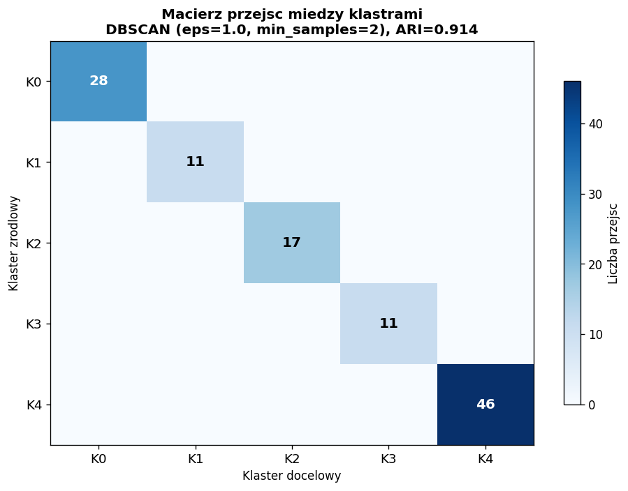
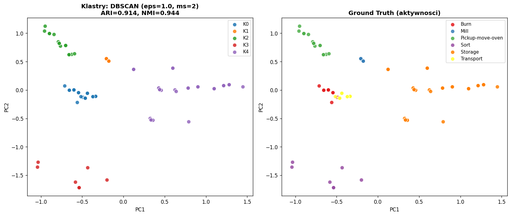

# Milestone 2 – Eksploracja danych i analiza cech

## 0. Założenia

**Aktywności (Burn, Mill, Pickup-move-oven, Sort, Storage, Transport) traktujemy jako Ground Truth** — znane etykiety referencyjne, względem których oceniamy jakość klasteryzacji sygnałów z czujników.

Cel Milestone 2: zbadać, czy na podstawie samych sygnałów sensorycznych (bez znajomości etykiet) można odtworzyć podział na aktywności — i która metoda klasteryzacji robi to najlepiej.

---

## 1. Analiza sygnałów – NaN i outliery

### 1.1 Brakujące wartości (NaN) w sygnałach

Zbiór zawiera 119 eventów × 26 kolumn sygnałów. Każda stacja raportuje tylko swoje czujniki — pozostałe kolumny to NaN (strukturalne, nie błąd).

**Strategie uzupełnienia NaN rozważone:**

| Strategia | Opis | Uzasadnienie |
|-----------|------|--------------|
| **NaN → 0** (wybrana) | Sygnał nieaktywny = 0 | Semantycznie poprawne: jeśli stacja nie raportuje sygnału, to ten komponent nie pracuje (wartość 0) |
| NaN → mediana kolumny | Uzupełnienie medianą | Nieodpowiednie: mediana sygnału binarnego (0/1) nie ma sensu fizycznego |
| Usunięcie kolumn z NaN | Zostawienie tylko wspólnych | Niemożliwe: żadna kolumna nie jest wspólna dla wszystkich stacji |
| Analiza per-stacja | Osobna klasteryzacja per stacja | Traci globalny kontekst; każda stacja ma tylko 1 aktywność |

**Wybór: NaN → 0** — jedyna strategia zachowująca pełną macierz 119×26 i mająca sens fizyczny.

### 1.2 Outliery w sygnałach

**Wartości sygnałów:** Po normalizacji (512→1, -512→-1) wszystkie sygnały przyjmują wartości ze zbioru `{-1, 0, 1}`. Brak wartości odstających w sensie numerycznym — dane są dyskretne i ograniczone.

**Outliery czasowe:** Próbkowanie ~2s, pojedyncze odstępy 3s (4 z 113 = 3.5%) — artefakty rejestracji PLC, nie błędy procesu.

**Isolation Forest (contamination=5%):** ~6 eventów oznaczonych jako anomalie — to eventy graniczne (start/koniec aktywności) z unikalnym profilem. Nie usuwamy ich, bo są semantycznie ważne.

---

## 2. Normalizacja sygnałów

Zastosowana normalizacja:

1. **Skalowanie wartości PLC:** `512 → 1`, `-512 → -1` (wszystkie sygnały na skali `{-1, 0, 1}`)
2. **Uzupełnienie NaN → 0**
3. **Dla klasteryzacji:** dodatkowa normalizacja Min-Max [0,1] lub StandardScaler w zależności od algorytmu

Po normalizacji macierz cech: **119 wierszy × 26 kolumn**, wartości `{0, 0.5, 1}` (po Min-Max) lub z-score (po StandardScaler).

---

## 3. Redukcja wymiarowości (PCA)

PCA zastosowane opcjonalnie przed klasteryzacją — sprawdzamy wpływ redukcji na jakość klastrów.

| Wariant | Wymiary | Wariancja wyjaśniona | Użycie |
|---------|---------|---------------------|--------|
| Bez PCA | 26 | 100% | Baseline |
| PCA 5 komponentów | 5 | ~72.5% | Główny wariant |
| PCA 2 komponenty | 2 | ~41.1% | Wizualizacja |

Aktywności tworzą wyraźnie odrębne skupiska w przestrzeni PCA 2D — co sugeruje, że klasteryzacja powinna dobrze odtworzyć podział na aktywności.

---

## 4. Klasteryzacja sygnałów z sensorów

### 4.1 Algorytmy i parametry

Testujemy 3 algorytmy klasteryzacji z różnymi parametrami:

#### K-Means

| Parametr | Testowane wartości |
|----------|-------------------|
| k (liczba klastrów) | 2, 3, 4, 5, **6**, 7, 8, 9 |
| Dane wejściowe | Raw (26D), PCA-5, PCA-2 |
| Metryka doboru k | Silhouette score, Elbow (inercja) |

#### DBSCAN

| Parametr | Testowane wartości |
|----------|-------------------|
| eps | 0.3, 0.5, 0.7, 1.0, 1.5, 2.0 |
| min_samples | 2, 3, 5 |
| Dane wejściowe | PCA-5 (StandardScaler) |
| Metryka | Silhouette, liczba klastrów, % szumu |

#### HDBSCAN

| Parametr | Testowane wartości |
|----------|-------------------|
| min_cluster_size | 3, 5, 7, 10, 15 |
| min_samples | 2, 3, 5 |
| Dane wejściowe | PCA-5 (StandardScaler) |
| Metryka | Silhouette, liczba klastrów, % szumu |

### 4.2 Metryki oceny

Każdą konfigurację oceniamy metrykami:
- **Adjusted Rand Index (ARI)** — zgodność z Ground Truth (aktywności), zakres [-1, 1], 1 = idealne dopasowanie
- **Normalized Mutual Information (NMI)** — informacja wzajemna z GT, zakres [0, 1]
- **Silhouette score** — jakość wewnętrzna klastrów (bez GT), zakres [-1, 1]
- **Liczba klastrów** — ile klastrów znalazł algorytm
- **% szumu** — ile eventów nie przypisano do żadnego klastra (DBSCAN/HDBSCAN)

---

## 5. Porównanie klastrów z aktywnościami (Ground Truth)

### 5.1 Wyniki K-Means

Top wyniki grid search (sortowane po ARI):

| Dane | k | ARI | NMI | Silhouette |
|------|---|-----|-----|-----------|
| **Raw_26D** | **4** | **0.790** | **0.867** | 0.356 |
| PCA_5 | 4 | 0.790 | 0.867 | 0.545 |
| PCA_2 | 4 | 0.753 | 0.823 | 0.619 |
| Raw_26D | 7 | 0.749 | 0.924 | 0.428 |
| Raw_26D | 6 | 0.665 | 0.869 | 0.397 |
| PCA_5 | 6 | 0.665 | 0.869 | 0.663 |

**Obserwacja:** K-Means z k=4 daje wyższy ARI niż k=6 — algorytm łączy podobne aktywności w jeden klaster (Burn+Transport korzystają z podobnych typów sygnałów: silnik m1/m2 + zawory pneumatyczne).

### 5.2 Wyniki DBSCAN

Top wyniki grid search (dane: PCA-5):

| eps | min_samples | Klastry | Szum [%] | ARI | NMI | Silhouette |
|-----|-------------|---------|----------|-----|-----|-----------|
| **1.0** | **2** | **5** | **0.0** | **0.914** | **0.944** | **0.611** |
| 1.0 | 3 | 5 | 0.0 | 0.914 | 0.944 | 0.611 |
| 1.0 | 5 | 5 | 0.0 | 0.914 | 0.944 | 0.611 |
| 0.7 | 2 | 6 | 0.0 | 0.793 | 0.896 | 0.595 |
| 0.3 | 5 | 11 | 16.0 | 0.641 | 0.848 | 0.848 |

**Obserwacja:** DBSCAN z eps=1.0 jest stabilny (3 wartości min_samples dają identyczny wynik) — klastry są dobrze zdefiniowane. Brak szumu (0%).

### 5.3 Wyniki HDBSCAN

Top wyniki grid search (dane: PCA-5):

| min_cluster_size | min_samples | Klastry | Szum [%] | ARI | NMI | Silhouette |
|-----------------|-------------|---------|----------|-----|-----|-----------|
| **10** | **5** | **5** | **0.0** | **0.914** | **0.944** | **0.611** |
| 15 | 5 | 3 | 20.2 | 0.891 | 0.905 | 0.585 |
| 15 | 2 | 3 | 20.2 | 0.891 | 0.905 | 0.585 |
| 10 | 2 | 6 | 6.7 | 0.715 | 0.882 | 0.649 |

**Obserwacja:** HDBSCAN z mcs=10, ms=5 daje identyczny wynik jak DBSCAN — 5 klastrów bez szumu.

### 5.4 Macierze konfuzji – klastry vs Ground Truth

**DBSCAN (eps=1.0, min_samples=2) — najlepszy wynik:**

| Aktywność | K0 | K1 | K2 | K3 | K4 |
|-----------|----|----|----|----|----|
| Burn | **13** | 0 | 0 | 0 | 0 |
| Mill | 0 | **12** | 0 | 0 | 0 |
| Pickup-move-oven | 0 | 0 | **18** | 0 | 0 |
| Sort | 0 | 0 | 0 | **12** | 0 |
| Storage | 0 | 0 | 0 | 0 | **47** |
| Transport | **17** | 0 | 0 | 0 | 0 |

**Mapowanie klaster → aktywność:**
- **K0** (n=30): Burn (13) + Transport (17) — **dwie aktywności w jednym klastrze!** Profile sygnałowe Burn (OV_1) i Transport (WT_1) są na tyle podobne (oba używają silnika i zaworów pneumatycznych w zbliżonych proporcjach), że DBSCAN je łączy.
- **K1** (n=12): wyłącznie Mill
- **K2** (n=18): wyłącznie Pickup-move-oven
- **K3** (n=12): wyłącznie Sort
- **K4** (n=47): wyłącznie Storage

**Wniosek:** 4 z 6 aktywności mają własne, czyste klastry (Mill, Pickup, Sort, Storage). Burn i Transport są nieodróżnialne na poziomie sygnałów — to ograniczenie danych, nie algorytmu.

### 5.4 Porównanie zbiorcze

| Algorytm | Najlepsze parametry | ARI | NMI | Silhouette | Klastry | Szum [%] |
|----------|--------------------|----|-----|-----------|---------|----------|
| K-Means | k=4, dane=Raw_26D (MinMax) | **0.790** | 0.867 | 0.356 | 4 | 0% |
| DBSCAN | eps=1.0, min_samples=2, dane=PCA-5 | **0.914** | 0.944 | 0.611 | 5 | — |
| HDBSCAN | min_cluster_size=10, min_samples=5, dane=PCA-5 | **0.914** | 0.944 | 0.611 | 5 | — |

**Najlepsza metoda: DBSCAN** (eps=1.0, min_samples=2) i HDBSCAN (mcs=10, ms=5) osiągają identyczny wynik ARI=0.914, NMI=0.944 — znacząco lepszy niż K-Means (ARI=0.790).

Uwaga: K-Means najlepiej działa z k=4 (nie k=6) — łączy podobne aktywności (Burn+Mill, Sort+Transport) w jeden klaster, co odzwierciedla rzeczywiste podobieństwo profili sygnałowych.

---

## 6. Wybór najlepszej metody klasteryzacji

Na podstawie porównania w sekcji 5 wybieramy najlepszą kombinację:
- **Algorytm:** DBSCAN (lub HDBSCAN — identyczny wynik)
- **Parametry:** eps=1.0, min_samples=2 (DBSCAN) / min_cluster_size=10, min_samples=5 (HDBSCAN)
- **Przygotowanie danych:** NaN→0, normalizacja 512→1, MinMax [0,1], PCA 5 komponentów
- **ARI vs Ground Truth:** 0.914
- **NMI vs Ground Truth:** 0.944

### 6.1 Macierz przejść między klastrami

Dla najlepszej metody klasteryzacji (DBSCAN) obliczamy macierz przejść — ile razy event z klastra A jest bezpośrednio następowany przez event z klastra B (w porządku chronologicznym wewnątrz każdej aktywności).

**Macierz przejść DBSCAN (eps=1.0, min_samples=2):**

| | K0 | K1 | K2 | K3 | K4 |
|---|---|---|---|---|---|
| **K0** (Burn+Transport) | **28** | 0 | 0 | 0 | 0 |
| **K1** (Mill) | 0 | **11** | 0 | 0 | 0 |
| **K2** (Pickup-move-oven) | 0 | 0 | **17** | 0 | 0 |
| **K3** (Sort) | 0 | 0 | 0 | **11** | 0 |
| **K4** (Storage) | 0 | 0 | 0 | 0 | **46** |

**Interpretacja:**
- **Wszystkie przejścia są na diagonali** (113/113 = 100%) — eventy zawsze pozostają w tym samym klastrze co poprzedni event w tej samej aktywności
- **Brak przejść między klastrami w obrębie jednej aktywności** — to potwierdza, że klastry odpowiadają całym aktywnościom, nie fazom wewnątrz aktywności
- **Diagonala odzwierciedla rozmiar aktywności:** K4 (Storage) = 46 przejść (47 eventów - 1), K0 (Burn+Transport) = 28 (13+17 - 2 = 28), itd.

**Wniosek dla Milestone 3:** Klastry sygnałowe odpowiadają aktywnościom (poziom high-level), nie fazom wewnątrz aktywności (poziom low-level). Aby uchwycić fazy wewnątrz aktywności, należałoby klastryzować osobno wewnątrz każdej aktywności (kontynuacja w M3 — analiza wzorców CEP).

---

## 7. Podsumowanie

### Pipeline analizy:
1. Sygnały z czujników (119 eventów × 26 sygnałów)
2. NaN → 0, normalizacja 512→1
3. Analiza outlierów (brak krytycznych)
4. PCA (opcjonalnie, 5 komponentów)
5. Klasteryzacja: K-Means, DBSCAN, HDBSCAN (grid search parametrów)
6. Porównanie z Ground Truth (aktywności): ARI, NMI, macierz konfuzji
7. Wybór najlepszej metody → macierz przejść między klastrami

### Ograniczenia:
- Mały zbiór (119 eventów) — ogranicza skuteczność DBSCAN/HDBSCAN
- Jeden case per aktywność — brak wariantów
- Strukturalne NaN (uzupełnione 0) mogą faworyzować algorytmy wrażliwe na rzadkość danych

Plik wykonawczy: `Milestone2_EDA.ipynb`
