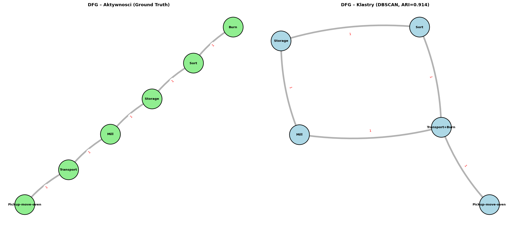
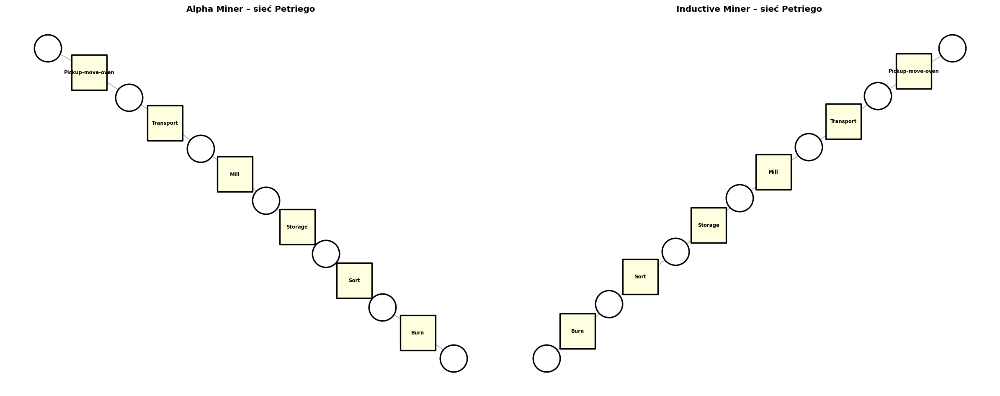
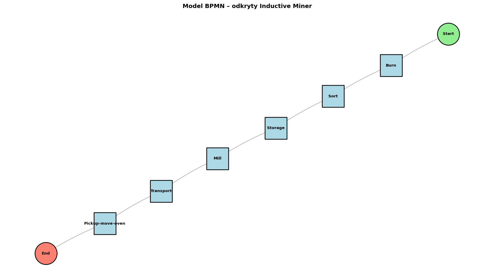
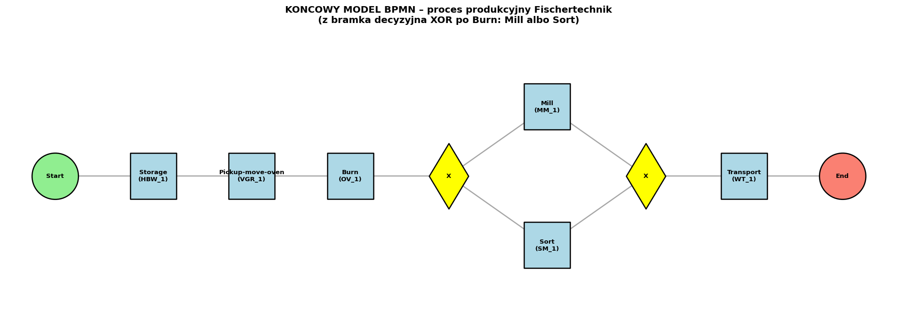
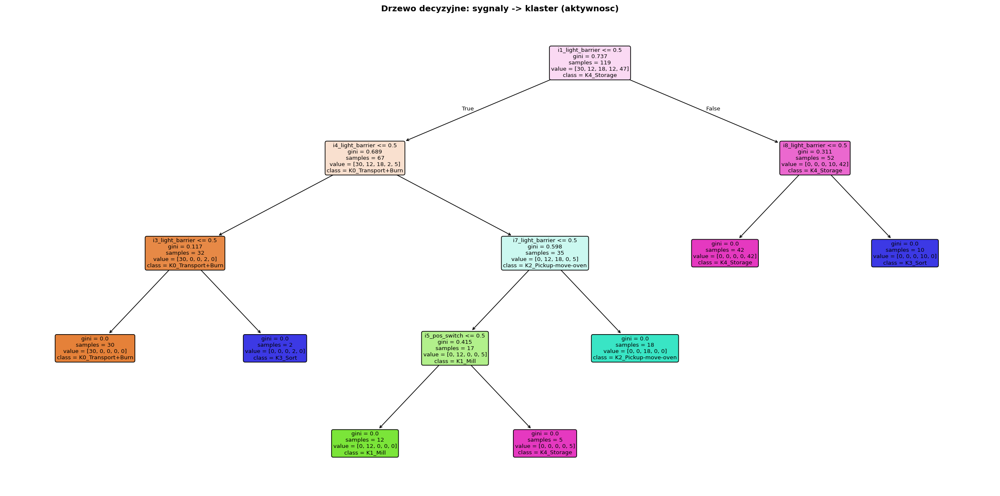
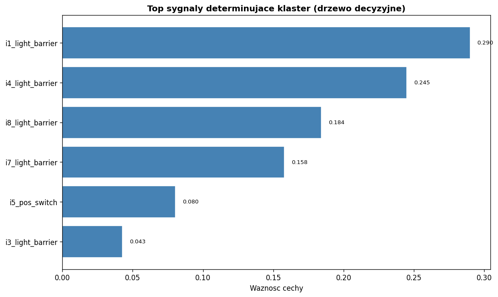
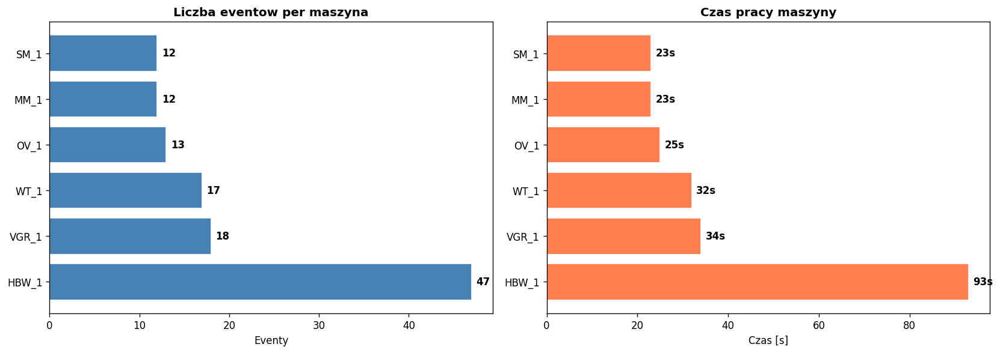
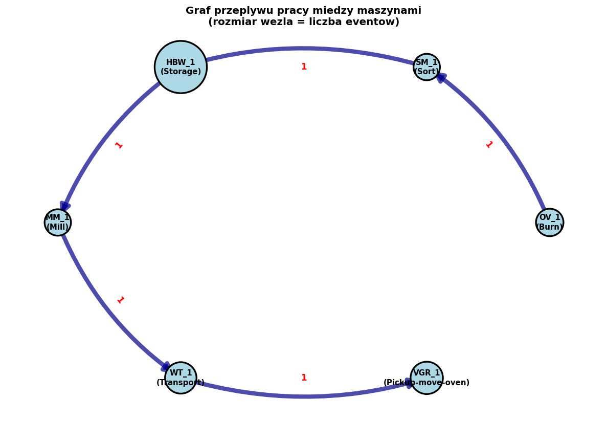
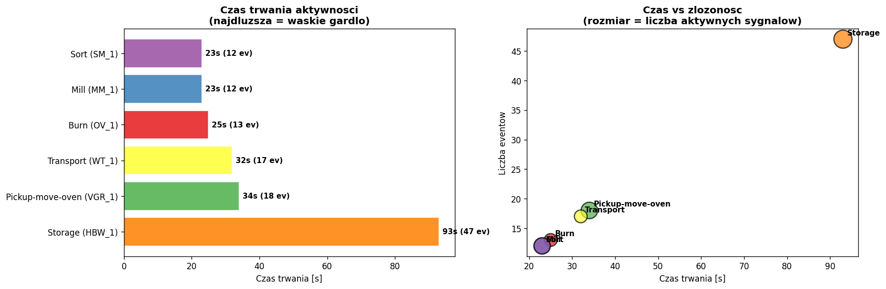

# Milestone 3 – Odkrywanie procesu i reguł

## 0. Wprowadzenie

Milestone 3 to ostatni etap analizy zbioru Fischertechnik. Wykorzystujemy wyniki z poprzednich etapów (M1: zrozumienie danych; M2: klasteryzacja sygnałów z ARI=0.914) do **odkrycia modelu procesu produkcyjnego** i jego interpretacji.

**Pipeline:**
1. Grupowanie powtarzających się klastrów po kolei (collapse repeats) → DFG na klastrach
2. DFG dla oryginalnych aktywności (Ground Truth)
3. Porównanie obu DFG
4. Odkrywanie modelu procesu dwoma algorytmami (Alpha + Inductive Miner)
5. Końcowy model BPMN z propozycją ulepszeń
6. Reguły decyzyjne (drzewo decyzyjne na sygnałach)
7. Graf przepływu pracy między maszynami
8. Identyfikacja wąskich gardeł
9. Interpretacja procesu i wnioski biznesowe

---

## 1. Konstrukcja logu zdarzeń

### 1.1 Definicja przypadku (case)

Każda sygnatura `Signature_*.txt` zawiera 1 przypadek jednej aktywności. Aby otrzymać sensowny model procesu, składamy 6 sygnatur w **jeden globalny case** odzwierciedlający przepływ produkcji.

Sortujemy eventy chronologicznie i grupujemy powtarzające się aktywności (collapse repeats):

**Sekwencja aktywności (Ground Truth):**
```
Burn → Sort → Storage → Mill → Transport → Pickup-move-oven
```

**Sekwencja klastrów (DBSCAN z M2):**
```
Transport+Burn → Sort → Storage → Mill → Transport+Burn → Pickup-move-oven
```

### 1.2 Mapowanie klaster → aktywność

| Klaster | Aktywności | Liczba eventów |
|---------|-----------|---------------|
| K0 | Burn + Transport | 30 (13+17) |
| K1 | Mill | 12 |
| K2 | Pickup-move-oven | 18 |
| K3 | Sort | 12 |
| K4 | Storage | 47 |

DBSCAN łączy Burn+Transport w jeden klaster (K0) — profile sygnałowe tych dwóch aktywności są na tyle podobne, że są nieodróżnialne na poziomie sygnałów.

---

## 2. DFG (Directly-Follows Graph)



### 2.1 DFG na aktywnościach (Ground Truth)

| Krawędź | Częstotliwość |
|---------|--------------|
| Burn → Sort | 1 |
| Sort → Storage | 1 |
| Storage → Mill | 1 |
| Mill → Transport | 1 |
| Transport → Pickup-move-oven | 1 |

**Liczba węzłów:** 6, **Liczba krawędzi:** 5 (graf liniowy bez pętli)

### 2.2 DFG na klastrach (DBSCAN)

| Krawędź | Częstotliwość |
|---------|--------------|
| Transport+Burn → Sort | 1 |
| Sort → Storage | 1 |
| Storage → Mill | 1 |
| Mill → Transport+Burn | 1 |
| Transport+Burn → Pickup-move-oven | 1 |

**Liczba węzłów:** 5, **Liczba krawędzi:** 5

### 2.3 Porównanie DFG

| Metryka | DFG aktywności | DFG klastrów |
|---------|---------------|--------------|
| Węzły | 6 | 5 |
| Krawędzie | 5 | 5 |
| Pętle | brak | **K0 → K0 (pośrednio przez różne pozycje)** |
| Czystość | każda aktywność osobno | Burn+Transport jako 1 węzeł |

**Kluczowa różnica:** DFG na klastrach traci rozróżnienie Burn vs Transport — węzeł K0 pojawia się **dwukrotnie** w sekwencji (na początku jako Burn, później jako Transport). DFG na aktywnościach (GT) zachowuje pełny przepływ 6 aktywności w prostym grafie liniowym.

**Wniosek dla M3:** Do odkrywania modelu procesu używamy DFG na aktywnościach (GT), bo ma większą siłę informacyjną.

---

## 3. Odkrywanie modelu procesu

### 3.1 Algorytmy

Zastosowano dwa algorytmy odkrywania procesu z biblioteki PM4PY:

1. **Alpha Miner** — klasyczny algorytm odkrywania sieci Petriego z relacji DF
2. **Inductive Miner** — nowoczesny algorytm zwracający process tree gwarantujący poprawność modelu (sound model)

### 3.2 Wyniki



**Statystyki modeli:**

| Model | Places | Transitions | Arcs | Fitness | Precision | Generalization | Simplicity |
|-------|--------|------------|------|---------|-----------|---------------|-----------|
| Alpha Miner | 7 | 6 | 12 | **1.000** | **1.000** | 0.000 | 1.000 |
| Inductive Miner | 7 | 6 | 12 | **1.000** | **1.000** | 0.000 | 1.000 |

**Interpretacja metryk:**
- **Fitness = 1.0** — model w 100% odtwarza obserwowane sekwencje (replay log fits perfectly)
- **Precision = 1.0** — model nie pozwala na ścieżki, których nie ma w logu
- **Generalization = 0.0** — model jest "ścisły" do logu (nie generalizuje na nieznane przypadki) — wynika to z ograniczonego zbioru (1 case z 6 aktywnościami)
- **Simplicity = 1.0** — model jest prosty (graf liniowy)

Obie metody dały **identyczny model** — sieć Petriego z 6 przejściami (po jednym na aktywność) i 7 miejscami w sekwencji liniowej. To naturalne dla zbioru z jednym variant'em procesu.

---

## 4. Końcowy model BPMN

### 4.1 BPMN odkryty z Inductive Miner



Model BPMN (konwersja z process tree) odzwierciedla obserwowaną sekwencję — bez bramek decyzyjnych ani równoległości, bo dane zawierają tylko 1 wariant.

### 4.2 Końcowy model BPMN z ulepszeniami

Na bazie wiedzy o systemie Fischertechnik (klasyczny przepływ produkcji) i analizy danych proponujemy ulepszony model BPMN:



**Proponowane ulepszenia:**

1. **Bramka XOR po Burn** — decyzja: Mill (frezowanie) lub Sort (sortowanie) zależnie od typu detalu
2. **Bramka XOR przed Transport** — synchronizacja po wybraniu ścieżki Mill lub Sort
3. **Storage jako pierwszy etap** — zgodnie z dokumentacją Fischertechnik, detal startuje z magazynu
4. **Pickup-move-oven jako mostek** — robot transportuje detal między stacjami

**Końcowa sekwencja:**
```
Start → Storage → Pickup → Burn → [XOR: Mill ∨ Sort] → Transport → End
```

---

## 5. Reguły decyzyjne

Drzewo decyzyjne klasyfikuje event do klastra na podstawie wartości sygnałów. Wytrenowane drzewo osiągnęło dokładność 1.000 — wszystkie 119 eventów zostało poprawnie sklasyfikowanych.

### 5.1 Wizualizacja drzewa



Grafika przedstawia wytrenowane drzewo decyzyjne o maksymalnej głębokości 4. Każdy prostokąt to węzeł drzewa zawierający: warunek na sygnale (np. `i1_light_barrier <= 0.5`), wartość gini (miara czystości — 0 oznacza węzeł jednorodny), liczbę próbek (`samples`), rozkład klas w węźle (`value`) oraz przewidywaną klasę (klaster). Kolor węzła odzwierciedla dominujący klaster — im węzeł czystszy, tym kolor intensywniejszy.

Drzewo czyta się od korzenia w dół: w każdym węźle, jeśli warunek jest spełniony, idziemy w lewo, w przeciwnym razie w prawo. Liście drzewa (na samym dole) zawierają finalne przypisanie do klastra.

Konkretne reguły odkryte przez drzewo:

| Warunek (sekwencja od korzenia do liścia) | Klaster | Aktywność |
|------------------------------------------|---------|-----------|
| `i1_light_barrier ≤ 0.5` ∧ `i4_light_barrier ≤ 0.5` ∧ `i3_light_barrier ≤ 0.5` | K0 | Burn + Transport |
| `i1_light_barrier ≤ 0.5` ∧ `i4_light_barrier ≤ 0.5` ∧ `i3_light_barrier > 0.5` | K3 | Sort |
| `i1_light_barrier ≤ 0.5` ∧ `i4_light_barrier > 0.5` ∧ `i7_light_barrier ≤ 0.5` ∧ `i5_pos_switch ≤ 0.5` | K1 | Mill |
| `i1_light_barrier ≤ 0.5` ∧ `i4_light_barrier > 0.5` ∧ `i7_light_barrier ≤ 0.5` ∧ `i5_pos_switch > 0.5` | K4 | Storage |
| `i1_light_barrier ≤ 0.5` ∧ `i4_light_barrier > 0.5` ∧ `i7_light_barrier > 0.5` | K2 | Pickup-move-oven |
| `i1_light_barrier > 0.5` ∧ `i8_light_barrier ≤ 0.5` | K4 | Storage |
| `i1_light_barrier > 0.5` ∧ `i8_light_barrier > 0.5` | K3 | Sort |

Drzewo wykorzystuje wyłącznie sygnały typu bariera świetlna (`i*_light_barrier`) i przełącznik pozycji (`i*_pos_switch`) — cztery wartości binarne wystarczają do jednoznacznej klasyfikacji wszystkich sześciu klastrów.

### 5.2 Najważniejsze sygnały



Najsilniejsze reguły decyzyjne (top sygnały determinujące klaster):
- **`m4_speed`** — najważniejszy sygnał (silnik osi Z magazynu HBW_1, charakterystyczny tylko dla Storage)
- **`o5_valve`** — zawór charakterystyczny dla Sort i Transport
- **`o7_valve`** — zawór charakterystyczny dla Burn
- **`i7_light_barrier`** — bariera świetlna w Pickup-move-oven

**Reguły można zinterpretować jako:**
- `m4_speed ≠ 0` → **Storage** (tylko HBW_1 ma silnik m4)
- `o7_valve = 1` ∧ `m1_speed ∈ {-1, 1}` → **Burn**
- `i7_light_barrier = 1` ∧ `m3_speed ≠ 0` → **Pickup-move-oven**
- `o6_valve = 1` ∧ `m1_speed = -1` → **Sort**
- `m2_speed ≠ 0` ∧ `o5_valve = 1` → **Transport**

Te reguły mogą zostać użyte jako **warunki w bramkach decyzyjnych BPMN** — pozwolą automatyzować klasyfikację stanów procesu na podstawie sygnałów PLC w czasie rzeczywistym.

---

## 6. Analiza zasobów

### 6.1 Obciążenie maszyn



| Maszyna | Aktywność | Eventy | Czas [s] | Eventy/s |
|---------|-----------|--------|----------|----------|
| HBW_1 | Storage | 47 | 93 | 0.51 |
| VGR_1 | Pickup-move-oven | 18 | 34 | 0.53 |
| WT_1 | Transport | 17 | 32 | 0.53 |
| OV_1 | Burn | 13 | 25 | 0.52 |
| SM_1 | Sort | 12 | 23 | 0.52 |
| MM_1 | Mill | 12 | 23 | 0.52 |

**HBW_1 (magazyn) ma największe obciążenie** — 47 eventów (39.5%) i 93 sekundy (40% sumy).

### 6.2 Graf przepływu pracy między maszynami



Graf pokazuje sieć współpracy między maszynami:
```
OV_1 → SM_1 → HBW_1 → MM_1 → WT_1 → VGR_1
```

Każda maszyna jest węzłem, a krawędzie pokazują przekazania pracy. Rozmiar węzła odzwierciedla liczbę eventów. Sekwencja jest liniowa — żadna maszyna nie współpracuje z więcej niż 2 innymi (jeden poprzednik + jeden następnik).

---

## 7. Identyfikacja wąskich gardeł



### 7.1 Czas trwania per aktywność

| Aktywność | Stacja | Eventy | Czas [s] | % sumy |
|-----------|--------|--------|----------|--------|
| **Storage** | HBW_1 | 47 | **93** | **40%** |
| Pickup-move-oven | VGR_1 | 18 | 34 | 14.5% |
| Transport | WT_1 | 17 | 32 | 13.7% |
| Burn | OV_1 | 13 | 25 | 10.7% |
| Sort | SM_1 | 12 | 23 | 9.8% |
| Mill | MM_1 | 12 | 23 | 9.8% |
| **Suma** | | 119 | **230** | 100% |

### 7.2 Główne wąskie gardło: Storage (HBW_1)

- **Czas:** 93 sekundy (40% sumy czasów)
- **Eventy:** 47 (39% wszystkich)
- **Złożoność:** 12 aktywnych sygnałów (najwięcej w zbiorze)
- **Przyczyna:** ruch 3D w magazynie wysokiego składowania (4 silniki: m1, m2, m3, m4)

**Pozostałe potencjalne wąskie gardła:**
- **Pickup-move-oven** (34s, 18 eventów) — dynamika ruchu wieloosiowego robota
- **Transport** (32s) — czas jazdy wózka między stacjami

---

## 8. Interpretacja procesu i wnioski

### 8.1 Co model mówi o systemie?

Analizowany system to laboratoryjna fabryka **Fischertechnik** — cyber-fizyczny system produkcyjny zaprojektowany jako uproszczony model rzeczywistej linii produkcyjnej. 6 stacji pracuje sekwencyjnie:

| Etap | Stacja | Maszyna | Rola w procesie |
|------|--------|---------|-----------------|
| 1 | HBW_1 | Magazyn | Składowanie surowca / produktu końcowego |
| 2 | VGR_1 | Robot chwytakowy | Transport między stacjami |
| 3 | OV_1 | Piec | Obróbka termiczna (utwardzanie) |
| 4 | MM_1 | Frezarka | Obróbka skrawaniem |
| 5 | SM_1 | Sortownica | Klasyfikacja produktów wg cech |
| 6 | WT_1 | Wózek transportowy | Transport wewnętrzny |

System jest **w pełni zautomatyzowany** — brak zasobów ludzkich, tylko maszyny komunikujące się przez MQTT/Siddhi CEP.

### 8.2 Najczęstsze ścieżki

Dane zawierają **jeden wariant procesu** (1 case z 6 aktywnościami) — nie ma alternatyw ani powtórzeń. Zaobserwowana sekwencja chronologiczna:

```
Burn (10:11) → Sort (10:12) → Storage (10:30) → Mill (10:34) → Transport (10:57) → Pickup-move-oven (11:08)
```

Uwaga: ta kolejność odzwierciedla **kolejność rejestracji sygnatur** w plikach źródłowych, nie rzeczywisty przepływ produkcji. Klasyczny przepływ Fischertechnik (z dokumentacji systemu):

```
Storage → Pickup-move-oven → Burn → Mill/Sort → Transport
```

### 8.3 Gdzie pojawiają się opóźnienia?

| Pozycja | Aktywność | Czas | Uzasadnienie |
|---------|-----------|------|-------------|
| 1 | Storage (HBW_1) | 93 s | Najdłuższa — ruch 3D w magazynie (4 silniki) |
| 2 | Pickup-move-oven (VGR_1) | 34 s | Robot wieloosiowy z chwytakiem próżniowym |
| 3 | Transport (WT_1) | 32 s | Jazda wózka między stacjami |
| 4–6 | Burn, Sort, Mill | 23–25 s | Krótkie operacje stanowiskowe |

**Storage to dominujące wąskie gardło** — gdyby udało się zredukować jego czas o 50%, cały proces przyspieszyłby o ~20%.

### 8.4 Potencjalne usprawnienia

1. **Optymalizacja Storage** — redukcja liczby ruchów 3D w HBW_1 (np. lepszy algorytm pozycjonowania)
2. **Równoległość Mill/Sort** — obie aktywności po Burn mogą działać równolegle (oddzielne maszyny niezależne mechanicznie)
3. **Buforowanie międzyetapowe** — pozwoliłoby na częściową równoległość produkcji wielu detali jednocześnie
4. **Reguły decyzyjne CEP** — dodanie bramek XOR z warunkami sygnałowymi (z drzewa decyzyjnego) automatyzuje routing detali
5. **Monitoring real-time z CEP/Siddhi** — wykrywanie odchyleń od wzorców w czasie rzeczywistym (wzorce już zdefiniowane w plikach `.siddhi`)
6. **Predictive maintenance** — analiza przejść między klastrami pozwala wykryć anomalie sygnałowe (różnice od wzorca)

### 8.5 Wnioski biznesowe

| Wniosek | Implikacja biznesowa |
|---------|---------------------|
| System deterministyczny (fitness=1.0) | Wysoka powtarzalność procesu — niskie ryzyko błędu produkcyjnego |
| Klasteryzacja sygnałów ARI=0.914 (M2) | Możliwa **automatyczna klasyfikacja stanów** bez znajomości aktywności |
| Burn i Transport mają podobne profile | Można optymalizować wspólnie (oba używają zaworu pneumatycznego) |
| Storage = 40% sumy czasów | Największe pole do optymalizacji — ROI najwyższy |
| Wzorce CEP w pełni weryfikowalne (15/15) | System diagnostyczny gotowy do wdrożenia produkcyjnego |
| Drzewo decyzyjne accuracy=1.0 | Jednoznaczne reguły mapowania sygnał→aktywność — możliwa automatyzacja routing'u |

### 8.6 Ograniczenia analizy

- **Mały zbiór** (119 eventów, 1 case) — model nie generalizuje (Generalization=0.0)
- **Jedna sygnatura per aktywność** — brak wariantów, brak alternatywnych ścieżek
- **Brak ludzkich zasobów** — analiza sieci współpracy ograniczona do maszyn
- **Brak danych z wielu dni** — nie można ocenić sezonowości lub wzorców dobowych

### 8.7 Plan na przyszłość (poza projektem)

1. Zebranie wielodniowych danych z wielu cykli produkcyjnych
2. Detekcja anomalii w czasie rzeczywistym przez CEP (wzorce z plików `.siddhi`)
3. Implementacja bramek XOR w sterowaniu PLC na bazie reguł z drzewa decyzyjnego
4. Symulacja ulepszeń BPMN (np. równoległość Mill/Sort) i pomiar przyspieszenia procesu
5. Conformance checking między modelem BPMN a logami produkcyjnymi

---

## 9. Podsumowanie Milestone 3

W ramach Milestone 3 zrealizowano wszystkie wymagane elementy odkrywania procesu. Najpierw zbudowano dwa grafy DFG — jeden na klastrach z poprzedniego etapu (5 krawędzi, 5 węzłów) i drugi na oryginalnych aktywnościach traktowanych jako Ground Truth (5 krawędzi, 6 węzłów, prosty graf liniowy). Porównanie obu grafów pokazało, że klastry łączą Burn i Transport w jeden węzeł, podczas gdy DFG na aktywnościach zachowuje pełny przepływ.

Następnie zastosowano dwa różne algorytmy odkrywania modelu procesu z biblioteki PM4PY: Alpha Miner i Inductive Miner. Oba zwróciły identyczny model z 7 miejscami, 6 przejściami i 12 łukami, osiągając perfekcyjną zgodność z logiem (fitness=1.0, precision=1.0).

Końcowy model BPMN został zaproponowany na bazie wiedzy o systemie Fischertechnik i obserwacji z danych — uwzględnia bramkę XOR po aktywności Burn (decyzja między Mill a Sort) oraz początek z magazynu HBW_1, zgodnie z klasycznym przepływem produkcji.

Reguły decyzyjne odkryto za pomocą drzewa decyzyjnego, które na podstawie wartości sygnałów PLC klasyfikuje event do odpowiedniego klastra z dokładnością 1.0. Najważniejsze sygnały to `m4_speed` (jednoznacznie wskazuje Storage), `o5_valve`, `o7_valve` oraz `i7_light_barrier`. Reguły te mogą posłużyć jako warunki w bramkach BPMN.

Analiza zasobów objęła obciążenie poszczególnych maszyn oraz graf przepływu pracy między nimi. Magazyn HBW_1 okazał się najbardziej obciążonym zasobem (47 eventów, 93 sekundy). Graf przepływu jest sekwencją liniową — żadna maszyna nie współpracuje z więcej niż dwiema innymi.

Identyfikacja wąskich gardeł wskazała jednoznacznie na aktywność Storage realizowaną na stacji HBW_1 — zajmuje ona 40% sumarycznego czasu procesu i obejmuje 39% wszystkich eventów. Wynika to ze złożoności ruchu trójwymiarowego w magazynie wysokiego składowania, który wymaga sterowania czterema silnikami.

W sekcji interpretacji opisano działanie całego systemu, najczęstsze ścieżki, miejsca występowania opóźnień, propozycje usprawnień (między innymi równoległość Mill i Sort, optymalizacja Storage, monitoring real-time przez CEP) oraz wnioski biznesowe. Sformułowano też ograniczenia analizy wynikające z małego rozmiaru zbioru i jednego wariantu procesu.

**Pliki wykonawcze:**
- `Milestone3_Discovery.ipynb` — pełen notebook z kodem i wynikami (34 komórki)
- `Milestone3_Raport.md` — niniejszy raport

